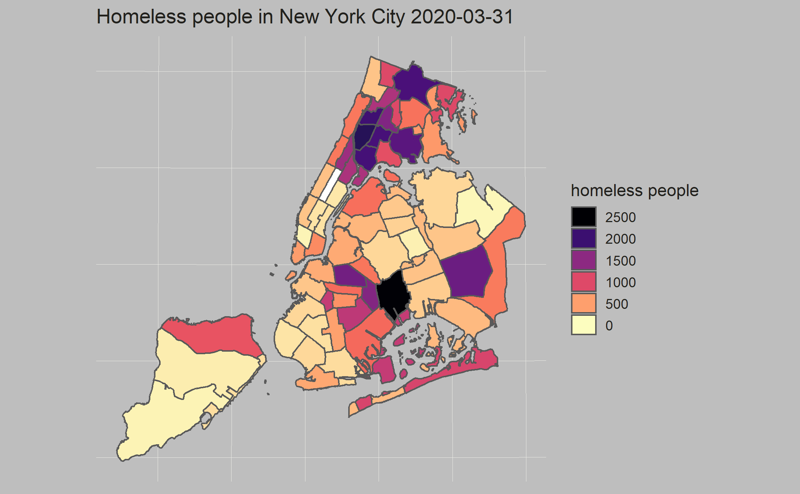

# Shiny Map Tutorial （[App link](https://tonyz.shinyapps.io/shiny_map_tutorial/))
5293 Spring 2022 Community Distribution Group 35

This is the Github page for 5293 Spring 2022 Community Distribution Group 35

## Group Member
+ CC 35
    + Haozhong Zheng (hz2694@columbia.edu)
    + Weixun Qian (wq2157@columbia.edu)

## Description
In this tutorial, we want to introduce how to build an APP that incorporates a map that is built on shapefiles. Main packages used would be **shiny** and **ggspatial**. Basically we would first give a quick introduction of shiny, and then introduce the preprocessing work of shapefiles to produce plots about maps, then we would build an advanced shiny app widget with what we introduced in the previous part.